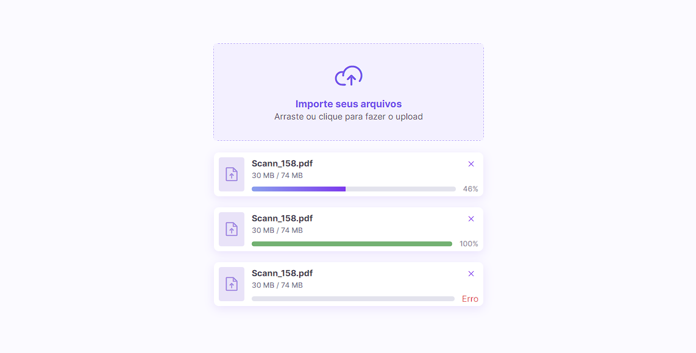

<h1 align="center"> Um componente de upload </h1>

<p align="center">
  
</p>

## 🚀 Tecnologias

Esse projeto foi desenvolvido com as seguintes tecnologias

- HTML e CSS
- JavaScript
- Figma
- Gulp
- Gulp-Sass
- Sass
- Concurrently
- Lite-server
- BEM (Block, Element e Modify)

## Projeto

### Primeiros passos no projeto

Executar o comando abaixo para baixar as dependências.

```
npm i ou npm install
```

Após baixar as dependências execute o projeto com o comando abaixo, o mesmo irá subir um servidor web na porta `3000`.

```
npm run start
```

### Preview do projeto

Para acesso a preview do projeto [clique aqui]()

## 🔖 Layout

Você pode visualizar o layout do projeto através [DESSE LINK](https://www.figma.com/community/file/1225440656930547927). É necessário ter conta no [Figma](https://figma.com) para acessá-lo.

## Licença

Esse projeto está sob a licença MIT.

---

Feito com ♥ by Thiago Soares 👋 [linkedin](https://www.linkedin.com/in/thiago-soares-3435916a/).
